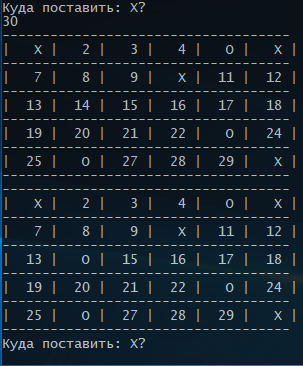
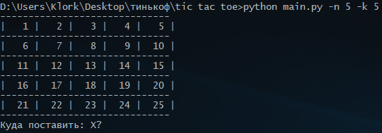
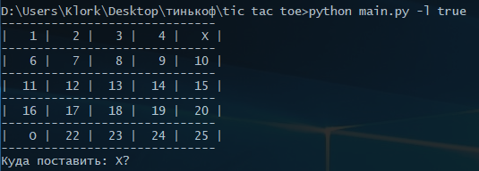
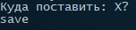

# Slapjack
> A game of one-player tic tac toe in your console.


### Game Rules
You must select one of the numbers in the table to put x
### Play the Game


##### Requirements
You must have 3.8+ to run the game.

##### Run the Game
Navigate to the directory in your console and then run:
```sh
$ python main.py -n "Кол-во строк" -k "Кол-во столбцов"
```

Or
```sh
$ python main.py -l true
```


##### Save the Game
Enter "save" when you are asked to enter x:
```sh
$ Куда поставить: X?
$ save
```

##### External Python Libraries Used
* `pickle`
* `argparse`
* `random`